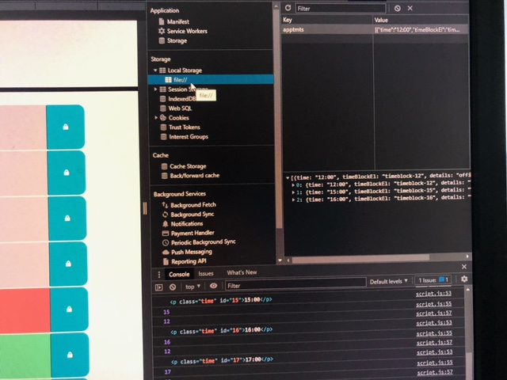

# Module 5 - Workday Scheduler

The purpose of this project is to use Jquery and Jquery UI functions along with concepts learned in Module 5 to create an online daily diary that stores any inputs into local storage, using the local storage to also enable that input to persist when the browser is refreshed.  Time blocks also change colour throughout the day to illustrate if the time in each block is in the past, the future or the present in relation to current time.

The following animation demonstrates the application functionality:

.

## Requirements

Moment.js must also be incorporated into the code and is used to reflect current time and enable the past/present/future comparison.

## Built With

HTML
CSS
Javascript / JQuery / Jquery UI

## Deployment

This site has been published via [Github Pages](https://lnd4812.github.io/workday-scheduler/).
The repository has been stored on [Github](https://github.com/lnd4812/workday-scheduler.git).

## Design and functionality

The main design uses starter HTML and CSS code for the layout of the webpage, while the script.js must be created from scratch.

Time blocks are established for between 8 and 10 hours to represent fairly standard working hours; the most convenient way to create such a layout was by hardcoding each time block in HTML and assigning specific classes and/or id's, in addition to the ones specified in the starter code, for integration with the javascript file.

The current date and time are added to the header using Moment.JS.  While the hour and minute fields of the function update automatically, the seconds do not progress without refreshing the browers, so a function using SetInterval was added to enable visible passage of the seconds.

An event handler was added via an **on("click")** function that saves any information input into any timeblock text area in LocalStorage in an array format via the localStorage **setItem** function and enabled to persist in those text areas by incorporating the the **localStorage getItem** function.

The CSS starter code includes classes meant to be added to the timeblock of the hour associated with each time block if it is in the past (grey), in the future (green) or current (red) to the current hour indicated by the Moment.js function, as illustrated in the animation link above.

.

## License

An MIT [License](LICENSE.md) has been included with this project.

## Credits and external Resources

- A full description of Challenge 5's criteria is outlined here: [Module 5 Challenge Project Page](https://courses.bootcampspot.com/courses/1181/assignments/23408?module_item_id=461381).
- Additional assistance was provided by the TA's and fellow learners during Office Hours, online via AskBCS and through one-on-one tutorial sessions.
- various internet websites including [MDN Docs](https://developer.mozilla.org), [W3Schools](https://www.w3schools.com) and [Stack Overflow](https://stackoverflow.com).

## Task list

[ ] Corrections for any ongoing issues where acceptance criteria not met.

## Contribution

Laurel David (github.com/lnd4812)

## Contact Information

For any questions, comments and/or issues, please contact me at email: laureldavid64@gmail.com.
